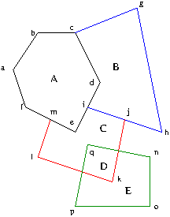

# vec2poly
utility to convert vector maps to polygons

## What and Why?

If you have ever found yourself drawing vector maps or diagrams by hand (in
Inkscape, XFig, or similar) and need to convert the map to a polygon map,
this could be the tool for you (when it's finished).

GDAL has a "Polygonize" utility which converts raster maps to polygons, but
it performs poorly on the type of maps used here - it generates polygons, but
far too many.

### What does it do?

Consider the following four vector paths:

1. The first path is abcdefa (black), a polygon
2. The second path is cghi (blue).  It forms a polygon by connecting up to the first polygon.
3. The third path is jklm (red).  It, too, forms a polygon only by connecting to other paths.
4. The fourth path is nopqn (green), a polygon

The task is to split the vector map into polygons A, B, C, D and E.

## Current Status

Works on paper...

# LICENCE

This work is licensed under [CC-BY-SA-4.0](https://creativecommons.org/licenses/by-sa/4.0/)
